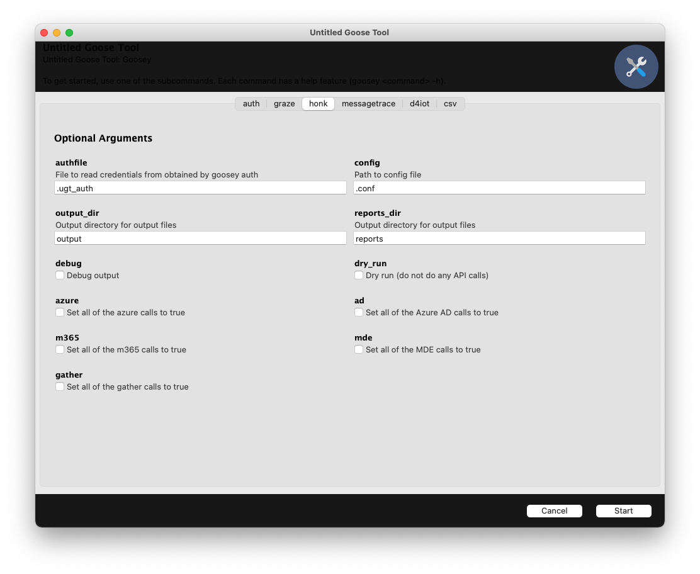

#

<div align="center">

<h3 align="center">Untitled Goose Tool</h3>

---
<p align="center"> The Goose is loose.
    <br>
</p>

</div>

## Table of Contents
- [About](#about)
- [Getting Started](#getting-started)
  - [Prerequisites](#prerequisites)
  - [Requirements](#requirements)
  - [Installing](#installing)
- [Usage](#usage)
  - [Config](#config)
  - [GUI](#gui)
  - [Auth](#auth)
  - [Csv](#csv)
  - [Graze](#graze)
  - [Honk](#honk)
  - [Messagetrace](#messagetrace)
  - [Recommended Default Workflow](#recommended-default-workflow)
  - [Recommended Workflow for UAL Call with Time Bounds](#recommended-workflow-for-ual-call-with-time-bounds)
  - [Considerations](#considerations)
- [Known Issues](#known-issues)
- [Acknowledgements](#acknowledgements)
- [Contributing](#contributing)
- [License](#license)
- [Legal Disclaimer](#legal-disclaimer) 

## About

Untitled Goose Tool is a robust and flexible hunt and incident response tool that adds novel authentication and data gathering methods in order to run a full investigation against a customer’s Azure Active Directory (AzureAD), Azure, and M365 environments. Untitled Goose Tool gathers additional telemetry from Microsoft Defender for Endpoint (MDE) and Defender for Internet of Things (IoT) (D4IoT).

This tool was designed to assist incident response teams by exporting cloud artifacts after an incident for environments that aren't ingesting logs into a Security Information and Events Management (SIEM) or other long term solution for logs.

For more guidance on how to use Untitled Goose Tool, please see: [Untitled Goose Tool Fact Sheet](https://www.cisa.gov/resources-tools/resources/untitled-goose-tool-fact-sheet)

## Getting Started

### Prerequisites
Python 3.7, 3.8, or 3.9 is required to run Untitled Goose Tool with Python.

Firefox is required for authenticating with Untitled Goose Tool.

It's also recommended to run Untitled Goose Tool within a virtual environment.

#### Mac OSX
```sh
pip3 install virtualenv
virtualenv -p python3 .venv
source .venv/bin/activate
```

#### Linux
```sh
# You may need to run sudo apt-get install python3-venv first
python3 -m venv .venv
source .venv/bin/activate
```

#### Windows
```console
# You can also use py -3 -m venv .venv
python -m venv .venv
.venv\Scripts\activate
```

### Requirements
The following AzureAD/m365 permissions are required to run Untitled Goose Tool, and provide it read-only access to the tenant.

A user account with the following permissions:

Exchange Online Admin Center
```
- View-Only Audit Logs
- View-Only Configuration 
- View-Only Recipients
- User Options
```

A service principal with the following permissions:

API Permissions
```
Microsoft Threat Protection:
- AdvancedHunting.Read.All (Application)

WindowsDefenderATP:
- AdvancedQuery.Read.All (Application)
- Alert.Read.All (Application)
- Library.Manage (Application)
- Machine.Read.All (Application)
- SecurityRecommendation.Read.All (Application)
- Software.Read.All (Application)
- Ti.ReadWrite (Application)
- Vulnerability.Read.All (Application)

Microsoft Graph:
- APIConnectors.Read.All (Application)
- AuditLog.Read.All (Application)
- ConsentRequest.Read.All (Application)
- Directory.Read.All (Application)
- Domain.Read.All (Application)
- IdentityProvider.Read.All (Application)
- IdentityRiskEvent.Read.All (Application)
- IdentityRiskyServicePrincipal.Read.All (Application)
- IdentityRiskyUser.Read.All (Application)
- MailboxSettings.Read (Application)
- Policy.Read.All (Application)
- Policy.Read.PermissionGrant (Application)
- Reports.Read.All (Application)
- RoleManagement.Read.All (Application)
- SecurityActions.Read.All (Application)
- SecurityAlert.Read.All (Application)
- SecurityEvents.Read.All (Application)
- UserAuthenticationMethod.Read.All (Application)
```

Azure Subscription IAM Roles
```
- Reader
- Storage Blob Data Reader
- Storage Queue Data Reader
```

When creating the service principal, make sure to save the client secret value (not the client secret ID).

### Installing
To install, clone the repository and then do a pip install:

```sh
git clone https://github.com/cisagov/untitledgoosetool.git
cd untitledgoosetool
python3 -m pip install . 
```

## Usage
### Config

Untitled Goose Tool requires authentication parameters and configuration. To automatically build the configuration file, run the following with the repository cloned:

```sh
$ python3 scripts/generate_conf.py
```

After this, `.conf` and `.d4iot_conf` files should be placed in your current directory. These files are used by Untitled Goose Tool. You should fill out the top section `[auth]` so that Untitled Goose Tool can properly auth to the appropriate resources.

The barebones config looks like:

```
[auth]
username=
password=
tenant=
us_government=
exo_us_government=
appid=
clientsecret=
subscriptionid=
m365=
msgtrace=

[filters]
date_start=
date_end=

[azure]
activity_log=False
alerts=False
all_azure_subscriptions=False
all_resources=False
assessments=False
bastion_logs=False
compliance=False
container_config=False
diagnostic_settings=False
file_shares=False
key_vault_log=False
network=False
nsg_flow_logs=False
portal_alerts=False
portal_defendersettings=False
portal_pcap=False
portal_sensors=False
security_center=False
storage_accounts=False
vm_config=False

[azuread]
applications=False
azuread_audit=False
azuread_provisioning=False
conditional_access=False
devices=False
directory_roles=False
groups=False
identity_provider=False
organization=False
policies=False
risk_detections=False
risky_objects=False
security=False
service_principals=False
signins_adfs=False
signins_msi=False
signins_rt=False
signins_sp=False
summaries=False
users=False

[m365]
exo_addins=False
exo_groups=False
exo_inboxrules=False
exo_mailbox=False
powershell_calls=False
ual=False

[mde]
advanced_hunting_query=False
alerts=False
indicators=False
investigations=False
library_files=False
machine_vulns=False
machines=False
recommendations=False
software=False

[msgtrc]
setemailaddress=
direction=
messageid=
notifyaddress=
originalclientip=
recipientaddress=
reporttitle=
reporttype=
senderaddress=
```

Here is a conf file with descriptions of the fields:

```
[auth]
username=The username of your account. ex: AAD_upn@example.onmicrosoft.com
password=The password of your account. ex: AAD_password
tenant=The tenant ID of your AAD tenant.
us_government=If you have a GCC High tenant, set this to True, otherwise set this to False.
exo_us_government=If your m365 tenant is a government tenant, set this to True, otherwise set this to False.
appid=The application ID of your service principal.
clientsecret=The client secret of your service principal (not the secret ID).
subscriptionid=If you want to check all of your Azure subscriptions, set this to All, otherwise enter your Azure subscription id. For multiple ids, separate it with commas, no spaces.
m365=If you have a m365 environment, set this to True, otherwise set this to False.
msgtrace=If you want to run message trace, set this to True, otherwise set this to False.

[filters]
date_start=Applies to Azure AD signin calls only. Maximum date range is 30 days ago. Format should be YYYY-MM-DD.
date_end=Applies to Azure AD signin calls only. Maximum date range is today's date. Format should be YYYY-MM-DD.

[azure]
activity_log=False
alerts=False
all_azure_subscriptions=False
all_resources=False
assessments=False
bastion_logs=False
compliance=False
container_config=False
diagnostic_settings=False
file_shares=False
key_vault_log=False
network=False
nsg_flow_logs=False
portal_alerts=False
portal_defendersettings=False
portal_pcap=False
portal_sensors=False
security_center=False
storage_accounts=False
vm_config=False

[azuread]
applications=False
azuread_audit=False
azuread_provisioning=False
conditional_access=False
devices=False
directory_roles=False
groups=False
identity_provider=False
organization=False
policies=False
risk_detections=False
risky_objects=False
security=False
service_principals=False
signins_adfs=False
signins_msi=False
signins_rt=False
signins_sp=False
summaries=False
users=False

[m365]
exo_addins=False
exo_groups=False
exo_inboxrules=False
exo_mailbox=False
powershell_calls=False
ual=False

[mde]
advanced_hunting_query=False
alerts=False
indicators=False
investigations=False
library_files=False
machine_vulns=False
machines=False
recommendations=False
software=False

[msgtrc]
setemailaddress=If you want to be notified by Microsoft when your message trace is ready, set this to True, otherwise set this to False.
direction=Choices are All, Inbound, Outbound.
messageid=If you want to check the status or export a message trace, you can input the message ID here.
notifyaddress=If you want to be notified by Microsoft when your message trace is ready for download, input an email here. If you have `setemailaddress=False`, you can leave this field blank.
originalclientip=If you have a client IP address you want to check, input the IP address here.
recipientaddress=Email address of the recipient that you want to run a message trace on.
reporttitle=Set the report title here.
reporttype=Choices are MessageTraceDetail or MessageTrace.
senderaddress=Email address of the sender that you want to run a message trace on.
```

The D4IoT config looks like:
```
[auth]
username=
password=
tenant=
appid=
clientsecret=
subscriptionid=
d4iot_sensor_token=
d4iot_mgmt_token=
d4iot_sensor_ip=
d4iot_mgmt_ip=

[d4iot]
mgmt_alerts=False
mgmt_devices=False
mgmt_pcap=False
mgmt_sensor_info=False
sensor_alerts=False
sensor_device_connections=False
sensor_device_cves=False
sensor_device_vuln=False
sensor_devices=False
sensor_events=False
sensor_operational_vuln=False
sensor_pcap=False
sensor_security_vuln=False
```

Here is a D4IoT conf file with descriptions of the fields:

```
[auth]
username=The username of your account. ex: AAD_upn@example.onmicrosoft.com
password=The password of your account. ex: AAD_password
tenant=The tenant ID of your AAD tenant.
appid=The application ID of your service principal.
clientsecret=The client secret of your service principal (not the secret ID).
subscriptionid=If you want to check all of your Azure subscriptions, set this to All, otherwise enter your Azure subscription id. For multiple ids, separate it with commas, no spaces.
d4iot_sensor_token=Enter your D4IoT sensor API token.
d4iot_mgmt_token=Enter your D4IoT management console API token.
d4iot_sensor_ip=Enter your D4IoT sensor IP.
d4iot_mgmt_ip=Enter your D4IoT management console IP.

[d4iot]
mgmt_alerts=False
mgmt_devices=False
mgmt_pcap=False
mgmt_sensor_info=False
sensor_alerts=False
sensor_device_connections=False
sensor_device_cves=False
sensor_device_vuln=False
sensor_devices=False
sensor_events=False
sensor_operational_vuln=False
sensor_pcap=False
sensor_security_vuln=False
```

To enable specific pulls, you can change occurrences of `False` to `True` (case insensitive).

### GUI
There is a simplified GUI based off of [Gooey](https://github.com/chriskiehl/Gooey). Note that colorings may be a bit off when you run.

To run with GUI:
```sh
$ goosey-gui
```

<p align="center">
  <a href="" rel="noopener">
 </a>
</p>

### Auth

```sh
$ goosey auth --help
usage: goosey auth [-h] [-a AUTHFILE] [--d4iot-authfile D4IOT_AUTHFILE] [-c CONFIG] [--d4iot-config D4IOT_CONFIG]
                   [--revoke] [--interactive] [--debug] [--d4iot]

optional arguments:
  -h, --help            show this help message and exit
  -a AUTHFILE, --authfile AUTHFILE
                        File to store the credentials (default: .ugt_auth)
  --d4iot-authfile D4IOT_AUTHFILE
                        File to store the credentials for defender for iOt(default: .d4iot_auth)
  -c CONFIG, --config CONFIG
                        Path to config file with auth credentials
  --d4iot-config D4IOT_CONFIG
                        Path to config file with d4iot auth credentials
  --revoke              Revoke sessions for user with credentials in tokenfile (default to .ugt_auth)
  --interactive         Interactive mode for Selenium. Default to false (headless).
  --debug               Enable debug logging to disk
  --d4iot               Run the authentication portion for d4iot
```

Run with defaults:
```sh
$ goosey auth
```

## Csv

```sh
$ goosey csv --help
usage: goosey csv [-h] [-o OUTPUT_DIR] [-r RESULT_DIR] [--debug]

optional arguments:
  -h, --help            show this help message and exit
  -o OUTPUT_DIR, --output_dir OUTPUT_DIR
                        The directory where the goose files are located
  -r RESULT_DIR, --result_dir RESULT_DIR
                        The directory where the goose files are located
  --debug               Debug output
```

Run with defaults:
```sh
$ goosey csv
```

### Graze
```sh
$ goosey graze --help
usage: goosey graze [-h] [-a AUTHFILE] [-o OUTPUT_DIR] [-d] [-e ENDPOINT]

optional arguments:
  -h, --help            show this help message and exit
  -a AUTHFILE, --authfile AUTHFILE
                        File to read credentials from obtained by goosey auth
  -o OUTPUT_DIR, --output-dir OUTPUT_DIR
                        Output directory for honk outputs
  -d, --debug           Debug output
  -e ENDPOINT, --endpoint ENDPOINT
                        Endpoint for UAL. Can change to localhost for testing if hosting local server.
```

Run with defaults:
```sh
$ goosey graze
```

### Honk

```sh
$ goosey honk --help
usage: goosey honk [-h] [-a AUTHFILE] [-c CONFIG] [--output-dir OUTPUT_DIR] [--reports-dir REPORTS_DIR] [--debug]
                   [--dry-run] [--azure] [--ad] [--m365] [--mde]

optional arguments:
  -h, --help            show this help message and exit
  -a AUTHFILE, --authfile AUTHFILE
                        File to read credentials from obtained by goosey auth
  -c CONFIG, --config CONFIG
                        Path to config file
  --output-dir OUTPUT_DIR
                        Output directory for output files
  --reports-dir REPORTS_DIR
                        Output directory for output files
  --debug               Debug output
  --dry-run             Dry run (do not do any API calls)
  --azure               Set all of the azure calls to true
  --ad                  Set all of the Azure AD calls to true
  --m365                Set all of the m365 calls to true
  --mde                 Set all of the MDE calls to true
```

Run with default options:
```sh
$ goosey honk
```

Run with debug messages, output to directory `my_outputs`, enable all Azure calls:
```sh
$ goosey honk --debug --output-dir my_outputs --azure
```

### Messagetrace

```sh
$ goosey messagetrace --help
usage: goosey messagetrace [-h] [--debug] [-c CONFIG] [-a AUTHFILE] [--output-dir OUTPUT_DIR] [--submit-report]
                           [--gather-report] [--status-check] [--interactive]

optional arguments:
  -h, --help            show this help message and exit
  --debug               Debug output
  -c CONFIG, --config CONFIG
                        Path to config file
  -a AUTHFILE, --authfile AUTHFILE
                        File to read credentials from obtained by goosey auth
  --output-dir OUTPUT_DIR
                        Output directory for output files
  --submit-report       Submits a message trace report
  --gather-report       Gathers a message trace report
  --status-check        Automates check status after submitting trace request
  --interactive         Interactive mode for Selenium. Default to false (headless).
```

Submitting a report for message trace:
```sh
$ goosey messagetrace --submit-report
```

Downloading a message trace report with interactive Selenium:
```sh
$ goosey messagetrace --gather-report --interactive
```

### Recommended Default Workflow

1. Fill out the .conf file with your information and set wanted calls to `True`.
2. Run `goosey auth`.
3. Run `goosey honk`.

### Recommended Workflow for UAL Call with Time Bounds

1. Fill out the .conf file with your information.
2. Run `goosey auth`.
3. Run `goosey graze` and wait until it's finished running.
4. Open the .conf file and set `ual` to `True`.
4. Run `goosey honk`.

### Considerations

1. We recommend filling out the .conf file with your information as a first step.
2. Always run `goosey auth` before making any other `goosey` call besides `goosey csv`, which doesn't require authentication to run.

### Known Issues

1. Having `%` in the password:

    **Solution:** Make sure to escape `%` in the password with `%%`.

2. Error when attempting to `pip install .` when you are using Windows and Python 3.10:

    ```sh
    Running setup.py install for wxpython did not run successfully.
    ```
    **Solution:** Downgrade Python to 3.9.x. It's a known issue with wxpython.

3. Error when attempting to `pip install .` when you are on Mac:

    ```sh
    ModuleNotFoundError: No module named 'certifi'
    ```
    **Solution:** Go to your applications folder, find your python version folder, and double click on the file "Install Certificates.command" inside the python folder to install the certificate.

4. Why does Untitled Goose Tool return two results for Exchange Online inbox rules and Exchange Online mailbox permissions?

    **Solution:** Both the API and PowerShell calls are robust and show different information, so we decided to keep both.

5. Error after running certain Azure Security Center calls:

    Azure Compliance Results:
    ```sh
    Error: (MissingSubscription) The request did not have a subscription or a valid tenant level resource provider.
    Code: MissingSubscription
    Message: The request did not have a subscription or a valid tenant level resource provider.
    ```

    Azure Information Protection Policies:
    ```sh
    Error: Operation returned an invalid status 'Not Found'
    ```

    Azure Assessments:
    ```sh
    Discriminator source is absent or null, use base class ResourceDetails.
    ```

    Azure SubAssessments:
    ```sh
    Subtype value GeneralVulnerability has no mapping, use base class AdditionalData.
    Subtype value SqlVirtualMachineVulnerability has no mapping, use base class AdditionalData.
    ```

    **Solution:** These messages aren't issues. Azure compliance result call will still complete. The Azure information protection policy call is not a critical error. The Azure assessments call spams the console with one line warning: "Discriminator source is absent or null, use base class ResourceDetails" and will complete without an issue (besides the console spam). The Azure subassessments call spams the console with one line warning: "Subtype value GeneralVulnerability has no mapping, use base class AdditionalData." or "Subtype value SqlVirtualMachineVulnerability has no mapping, use base class AdditionalData." and will complete without an issue (besides the console spam).

6. Users on MacOS and/or *nix systems might not be able to run the EXO.ps1 PowerShell script.

    **Solution:** We recommend using Windows if you want to run the PowerShell script.

7. Firefox geckodriver not in PATH

    ```sh
    auth - ERROR - Error getting Firefox webdriver: Message: 'geckodriver' executable needs to be in PATH.
    ```

    **Solution:** Run the following commands:

    ```sh
    #For Windows:
    webdrivermanager firefox:v0.32.0 --linkpath AUTO
    #For *nix (you might need sudo):
    webdrivermanager firefox:v0.32.0 --linkpath /usr/local/bin
    ```

8. Excessive amount of 429 errors during `goosey honk`

    **Solution:** Untitled Goose Tool will quickly encounter the Graph API limitations of a tenant; this is a limitation that Microsoft has on Graph API calls. 


## Acknowledgements

- Claire Casalnova
- Jordan Eberst
- Wellington Lee
- Victoria Wallace

## Contributing

We welcome contributions!  Please see [here](CONTRIBUTING.md) for details.

## License

This project is in the worldwide [public domain](LICENSE).

This project is in the public domain within the United States, and copyright and related rights in the work worldwide are waived through the [CC0 1.0 Universal public domain dedication](https://creativecommons.org/publicdomain/zero/1.0/).

All contributions to this project will be released under the CC0 dedication. By submitting a pull request, you are agreeing to comply with this waiver of copyright interest.

## Legal Disclaimer

NOTICE

This software package (“software” or “code”) was created by the United States Government and is not subject to copyright within the United States. All other rights are reserved. You may use, modify, or redistribute the code in any manner. However, you may not subsequently copyright the code as it is distributed. The United States Government makes no claim of copyright on the changes you effect, nor will it restrict your distribution of bona fide changes to the software. If you decide to update or redistribute the code, please include this notice with the code. Where relevant, we ask that you credit the Cybersecurity and Infrastructure Security Agency with the following statement: “Original code developed by the Cybersecurity and Infrastructure Security Agency (CISA), U.S. Department of Homeland Security.”

USE THIS SOFTWARE AT YOUR OWN RISK. THIS SOFTWARE COMES WITH NO WARRANTY, EITHER EXPRESS OR IMPLIED. THE UNITED STATES GOVERNMENT ASSUMES NO LIABILITY FOR THE USE OR MISUSE OF THIS SOFTWARE OR ITS DERIVATIVES.

THIS SOFTWARE IS OFFERED “AS-IS.” THE UNITED STATES GOVERNMENT WILL NOT INSTALL, REMOVE, OPERATE OR SUPPORT THIS SOFTWARE AT YOUR REQUEST. IF YOU ARE UNSURE OF HOW THIS SOFTWARE WILL INTERACT WITH YOUR SYSTEM, DO NOT USE IT.
